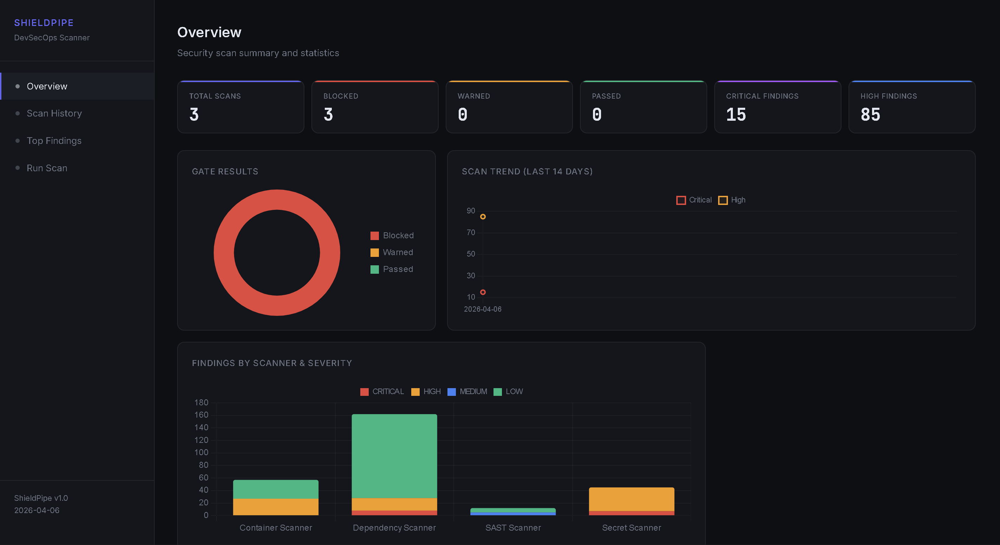
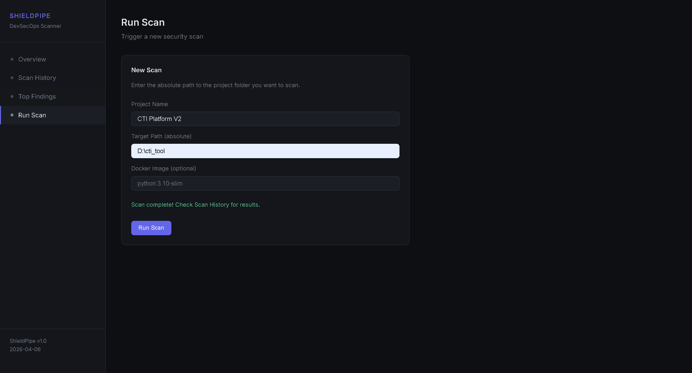
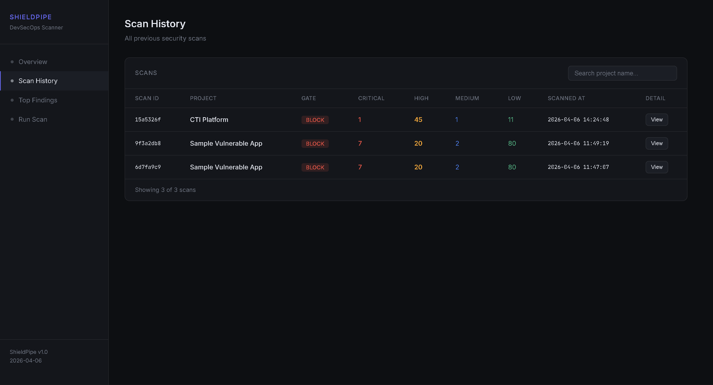
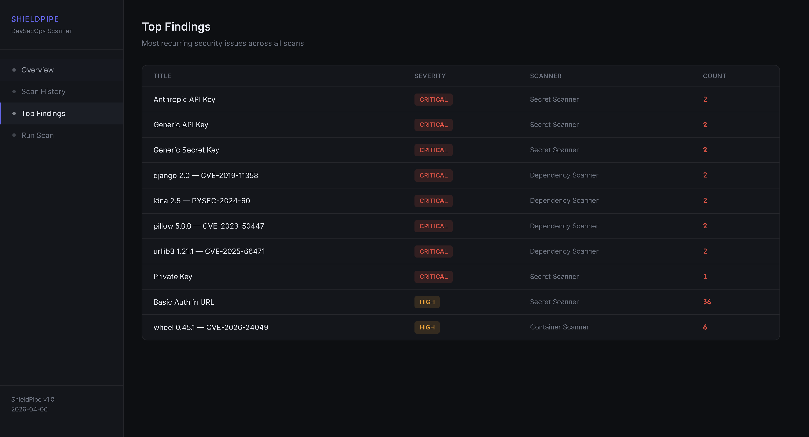
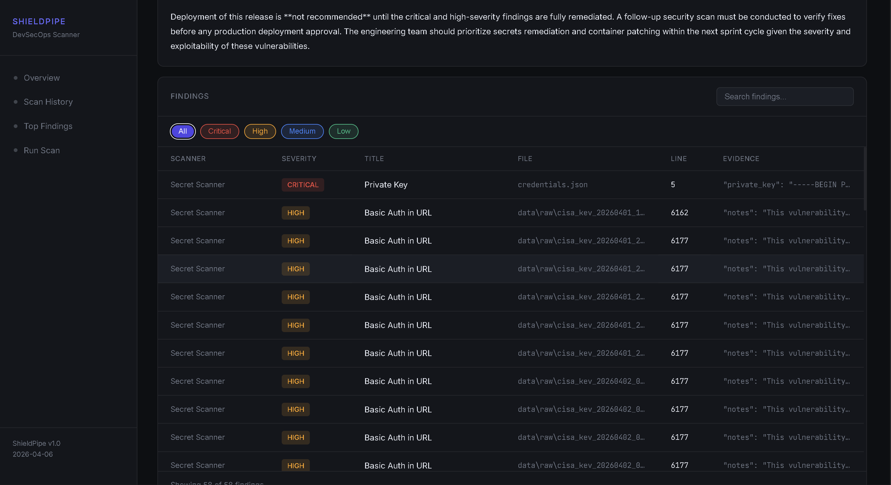
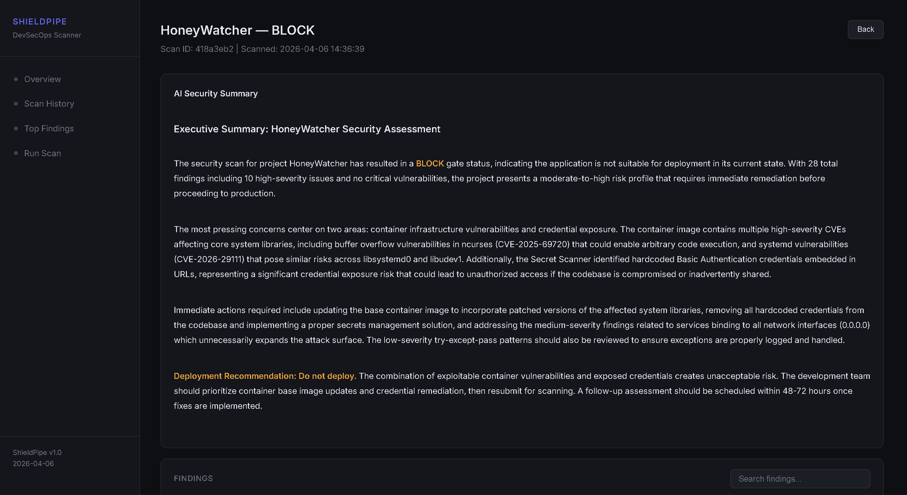
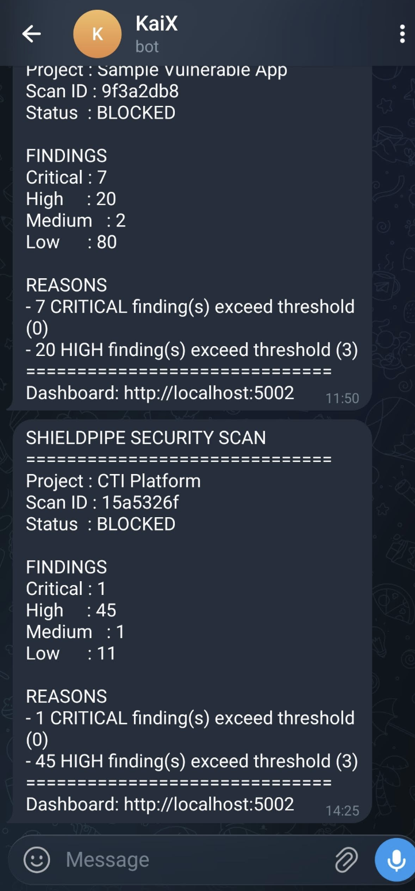

# ShieldPipe

DevSecOps security pipeline scanner that performs automated security analysis across multiple attack surfaces before deployment.

---

## Screenshots

<<<<<<< HEAD
## Scan Overview

| Overview | Run Scan | Scan History |
|----------|----------|--------------|
|  |  |  |

## Findings

| Top Findings | Detail View |
|--------------|-------------|
|  |  |

## AI Summary

| AI Summary |
|------------|
|  |

## Telegram

| Telegram Alert |
|------------|
|  |

---

## Overview

ShieldPipe is a standalone DevSecOps portfolio project that simulates a security-first CI/CD pipeline. It scans any Python project folder for security issues across four categories: hardcoded secrets, static code vulnerabilities, vulnerable dependencies, and container image vulnerabilities. Results are stored in a local database, reviewed through a web dashboard, and summarized using AI-generated executive reports.

This is not a production security tool. It is built to demonstrate understanding of DevSecOps principles, security automation, and shift-left security practices.

---

## Pipeline Flow

```
Developer submits project folder
              |
              v
  Secret Scanner (regex-based)
  Detect hardcoded API keys, passwords, tokens
              |
              v
  SAST Scanner (Bandit)
  Static analysis for unsafe code patterns
              |
              v
  Dependency Scanner (pip-audit)
  Check library CVEs against vulnerability databases
              |
              v
  Container Scanner (Trivy)
  Scan Docker base image for OS and package CVEs
              |
              v
  Security Gate
  Evaluate findings against thresholds
  CRITICAL > 0  -> BLOCK
  HIGH > 3      -> BLOCK
  MEDIUM > 10   -> WARN
              |
              v
  AI Summary (Claude API)
  Generate executive-level security narrative
              |
              v
  Telegram Alert + Dashboard
```

---

## Features

- **Secret Scanner** — Regex-based detection of hardcoded API keys, tokens, passwords, private keys, and database URLs across the entire codebase. Respects `.gitignore` to skip intentionally excluded files.
- **SAST Scanner** — Static analysis via Bandit, detecting SQL injection patterns, unsafe function usage, hardcoded credentials, and other common Python security issues.
- **Dependency Scanner** — Vulnerability check via pip-audit against known CVE databases, with severity classification based on vulnerability description keywords.
- **Container Scanner** — Docker image scanning via Trivy, covering OS packages and Python libraries inside the container.
- **Security Gate** — Configurable thresholds per severity level that determine whether a deployment should be blocked, warned, or passed.
- **AI Summary** — Claude API generates a structured executive summary covering security posture, critical findings, and deployment recommendation.
- **Real-time Dashboard** — Flask web UI with scan history, finding detail view, top findings across all scans, and inline AI summary with Markdown rendering.
- **Run Scan from UI** — Trigger scans directly from the dashboard with animated loading state and background polling.
- **Telegram Notification** — Instant alert with scan result, gate status, and finding counts after each scan completes.

---

## Tech Stack

| Component | Technology |
|---|---|
| Language | Python 3.10+ |
| Secret Detection | regex (built-in) |
| SAST | Bandit |
| Dependency Scan | pip-audit |
| Container Scan | Trivy |
| AI Summary | Anthropic Claude API |
| Dashboard | Flask |
| Database | SQLite |
| Charts | Chart.js |
| Markdown Render | marked.js |
| Notification | Telegram Bot API |

---

## Project Structure

```
shieldpipe/
├── main.py                      # CLI entry point
├── database.py                  # DB init and connection
├── requirements.txt
├── .env.example
├── sample_project/              # Demo vulnerable project for testing
│   ├── app.py
│   └── requirements.txt
├── scanners/
│   ├── secret_scanner.py        # Hardcoded secret detection
│   ├── sast_scanner.py          # Static analysis via Bandit
│   ├── dependency_scanner.py    # CVE check via pip-audit
│   └── container_scanner.py     # Image scan via Trivy
├── engine/
│   ├── pipeline.py              # Scan orchestration
│   ├── gate.py                  # Security gate logic
│   └── ai_summary.py            # Claude AI summary
├── notifier/
│   └── telegram.py              # Telegram alert
└── dashboard/
    ├── app.py                   # Flask routes and API
    ├── templates/
    │   └── index.html
    └── static/
        ├── style.css
        └── app.js
```

---

## Installation

```bash
git clone https://github.com/yourusername/shieldpipe.git
cd shieldpipe
python -m venv venv
venv\Scripts\activate        # Windows
pip install -r requirements.txt
```

Install Trivy separately from: https://github.com/aquasecurity/trivy/releases/latest
Add `trivy.exe` to your system PATH.

Copy `.env.example` to `.env` and fill in your values:

```bash
cp .env.example .env
```

---

## Configuration

```env
ANTHROPIC_API_KEY=your_claude_api_key
TELEGRAM_BOT_TOKEN=your_telegram_bot_token
TELEGRAM_CHAT_ID=your_chat_id
```

---

## Usage

```bash
# Scan via CLI
python main.py --target /path/to/project --name "Project Name"

# Scan with specific Docker image
python main.py --target /path/to/project --name "Project Name" --image python:3.10-slim

# Run dashboard
python dashboard/app.py
```

Dashboard available at: `http://localhost:5002`

---

## Security Gate Thresholds

| Severity | Threshold | Action |
|---|---|---|
| CRITICAL | 0 | BLOCK |
| HIGH | 3 | BLOCK |
| MEDIUM | 10 | WARN |
| LOW | 99 | PASS |

Thresholds are configurable in `engine/gate.py`.

---

## Security Concepts Demonstrated

- Shift-left security — security integrated into the development pipeline, not after deployment
- Multi-layer scanning — secrets, code, dependencies, and container are scanned independently
- Risk-based gating — deployment decisions based on finding severity thresholds
- Secrets hygiene — `.gitignore`-aware scanning to reduce false positives
- Intelligence dissemination — AI-generated executive summary for non-technical stakeholders
- Security automation — end-to-end pipeline runs without manual intervention

---

## Disclaimer

This project is intended for educational and portfolio purposes only. Scan only projects and systems you own or have explicit permission to analyze.

---

## Author

Saya
